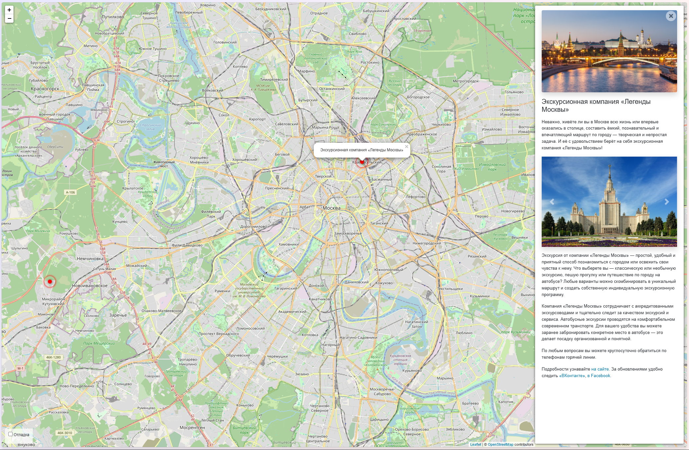

# Куда пойти

Сайт о самых интересных местах в Москве.



## Требования проекта

- Python: 3.10–3.13
- Django: 5.1.x
- python-dotenv: 1.x
- Pillow: 11.3.x (для работы с изображениями)
- django-admin-sortable2: 2.2.x (сортировка объектов в админке)
- django-tinymce: 4.1.x (редактор HTML в админке)

## Установка и настройка

1. Клонируйте репозиторий:

   ```bash
   git clone https://github.com/AlexKlos/DVMN_l22.git
   ```

2. Создайте виртуальное окружение а папке проекта:

   ```bash
   python -m venv venv
   source venv/bin/activate  # или venv\Scripts\activate на Windows
   ```

3. Установите зависимости:

   ```bash
   pip install -r requirements.txt
   ```

4. Создайте ключ Django:
   ```bash
   python -c "from django.core.management.utils import get_random_secret_key; print(get_random_secret_key())"
   ```

5. Создайте и настройте файл `.env`:

   ```env
   DJANGO_SECRET_KEY=...                      # Ключ Django
   DJANGO_DEBUG=False                         # Режим разработки (False для продакшн)
   DJANGO_ALLOWED_HOSTS=127.0.0.1,localhost   # Разрешённые хосты (через запятую, без пробелов)
   DJANGO_TIME_ZONE=Asia/Bangkok              # Часовой пояс проекта
   DJANGO_LANGUAGE_CODE=en-us                 # Язык интерфейса
   DJANGO_MEDIA_ROOT=media                    # Папка для пользовательских файлов (media)
   DJANGO_STATIC_ROOT=staticfiles             # Папка для собранных статических файлов (staticfiles)
   ```

7. Примените миграции:
   ```bash
   python manage.py migrate
   ```

8. Создайте суперпользователя Django:
   ```bash
   python manage.py createsuperuser
   ```

9. Запустите сервер разработки:
   ```bash
   python manage.py runserver
   ```

## Использование

- После запуска сайт будет доступен по адресу:
   ```
   http://127.0.0.1:8000
   ```

- Редактирование данных через панель администратора по адресу:
   ```
   http://127.0.0.1:8000/admin/
   ```
   Доступ по реквизитам суперпользователя Django (см. п.7.)

## Цели проекта

Код написан в учебных целях — для курса по Python и веб-разработке на сайте [Devman](https://dvmn.org).

Тестовые данные взяты с сайта [KudaGo](https://kudago.com).
